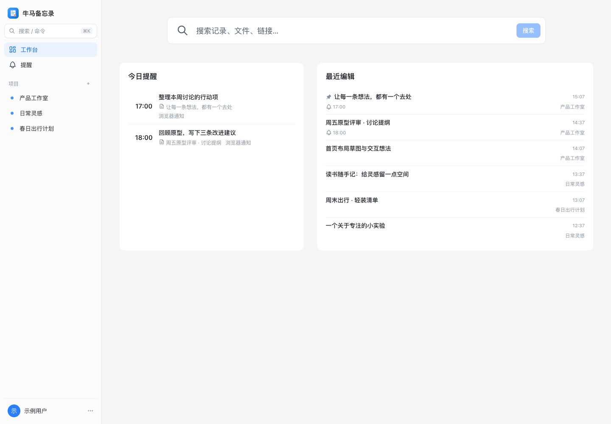
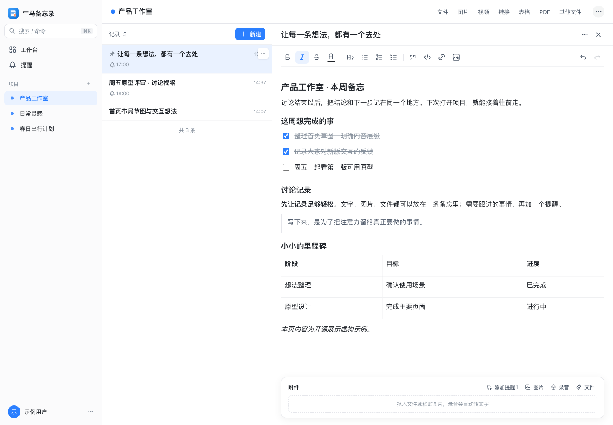
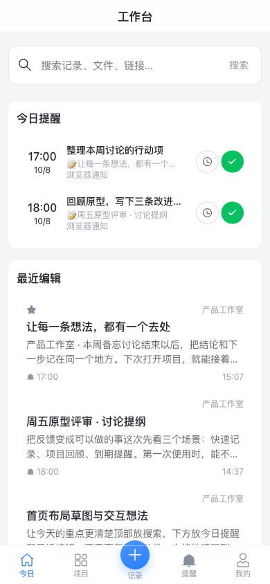
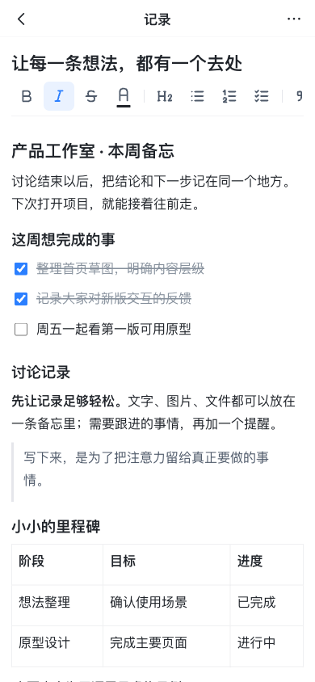

# 牛马备忘录
PC端+安卓端，有时候自己有很多想法需要记录下来，但是一些商业软件过于臃肿，并且信息安全也是未知数，所以我就开发了这个项目，已经使用了一段时间，感觉还不错。所以分享出来，供大家参考！

把零散的想法、沟通记录、文件和提醒，放回各自的项目里。

一个可自行部署的工作备忘系统，提供独立的桌面端和手机端界面。前端使用 Vue 3，后端使用 ThinkPHP 8，数据保存在自己的 MySQL 中。

**Apache-2.0 开源** · 完整前后端 · MySQL 结构与迁移 · PWA · Android 网页壳

## 看看界面

以下图片均在本地隔离环境使用虚构示例内容拍摄，不包含真实账号、工作记录或附件。

### 桌面工作台



### 项目与记录编辑



### 手机端

 

## 有什么功能

- **按项目整理记录**：项目、富文本编辑、置顶、归档、回收站和全文搜索。
- **内容与附件放在一起**：图片、音频、视频、PDF、文档等；项目内汇总文件、图片、链接和表格。
- **提醒**：单次或重复提醒，支持 Web Push、Bark、企业微信机器人。
- **可选 AI**：根据内容生成标题，录音转文字；不开通外部服务也能使用基本记录功能。
- **多端使用**：Naive UI 桌面界面、Vant 手机界面、PWA 安装，以及 Android WebView 外壳源码。
- **私有存储**：本地附件或腾讯云 COS，由后端鉴权后访问。

仓库不包含真实业务数据、上传附件、生产配置、签名密钥或已签名 APK。云存储、模型和语音识别服务需要使用者自行配置，相关费用由对应服务商收取。

## 快速开始

需要 PHP 8.2+、Composer 2、MySQL 8.0（含 `ngram` 全文解析器）和 Node.js 20+。PHP 扩展包括 `pdo_mysql`、`mbstring`、`fileinfo`、`gd`、`curl`、`openssl`、`gmp`；以 `composer check-platform-reqs` 为准。ffmpeg / ffprobe 用于音视频处理，可按需安装。

### 1. 新建空数据库

以下名称为示例；请自己设置数据库密码，并把相同配置填写到后端 `.env`。

```sql
CREATE DATABASE niuma_memo CHARACTER SET utf8mb4 COLLATE utf8mb4_unicode_ci;
CREATE USER 'memo'@'localhost' IDENTIFIED BY 'replace-with-your-own-password';
GRANT ALL PRIVILEGES ON niuma_memo.* TO 'memo'@'localhost';
```

### 2. 启动后端

```bash
cd api
composer install
cp .example.env .env
# 编辑 .env：DB_HOST / DB_NAME / DB_USER / DB_PASS
# 运行下面命令生成 JWT_SECRET，将输出填入 .env，不要提交该文件
php -r 'echo bin2hex(random_bytes(32)), PHP_EOL;'
php think migrate:run
php think user:create laowang laowang --nickname=老王
php think run -p 8787
```

示例配置默认使用本地附件存储，关闭语音识别；AI 与推送密钥均为空。`APP_URL=http://localhost:5173`、`UPLOAD_ACCEL=false` 适用于本地开发。

### 3. 启动前端

```bash
cd web
npm ci
npm run dev
```

访问 `http://localhost:5173`，初始化后的默认账号是 **`laowang`**，默认密码也是 **`laowang`**。首次登录后请在设置中修改密码。前端开发服务将 `/api` 代理到本机 `8787`。

### 4. 启用后台任务

提醒、语音转写和 AI 标题队列需要定时运行：

```bash
cd api
php think reminder:scan
php think asr:run
php think notes:titles
```

生产环境按 `deploy/crontab` 每分钟执行；Docker 部署包含后台任务容器。

## 数据库结构

- [完整 SQL 结构](api/database/schema.sql)：由空库执行全部迁移后生成，只有结构，没有业务数据、账号或密码哈希。
- [数据库说明](docs/DATABASE.md)：表用途、初始化方式、迁移与备份注意事项。
- [原始迁移](api/database/migrations/)：升级数据库时执行 `php think migrate:run`。

通常使用迁移初始化即可。如果手动导入 `schema.sql`，之后也要执行一次 `php think migrate:run` 来登记迁移状态；迁移支持这条初始化路径。

## 部署与配置

见 [部署说明](docs/DEPLOYMENT.md)，包含 Docker Compose、宝塔 / 裸机部署、配置项、后台任务与 Android 构建入口。域名统一使用 `memo.example.com` 占位，部署前替换为自己的域名。

生产环境必须生成自己的 `JWT_SECRET`、数据库密码和 HTTPS 证书，设置 `APP_DEBUG=false`。网站根目录只指向 `api/public`。

## 目录

```text
api/                 ThinkPHP API、配置、完整数据库结构和迁移
web/                 Vue 桌面端、手机端与共享业务逻辑
android-shell/       Android 在线网页壳源码和构建脚本
deploy/              Docker、Nginx、定时任务和发布模板
docs/                文档、演示截图与联系二维码
scripts/             开源文件检查工具
```

## 开发与贡献

```bash
cd web && npm ci && npm run build
cd ../api && composer install && composer check-platform-reqs
cd .. && python3 scripts/check-public-tree.py
```

提交前不要加入 `.env`、数据库导出、附件、日志或个人信息。请阅读 [贡献说明](CONTRIBUTING.md) 和 [安全说明](SECURITY.md)。历史 [设计方案](docs/设计方案.md) 仅供理解早期设计，功能与结构以当前源码为准。

## 联系与交流

欢迎扫码添加微信，交流使用体验、反馈建议。


## 许可证

本项目采用 [Apache License 2.0](LICENSE)。第三方依赖继续遵循各自许可证；原始声明见 [NOTICE](NOTICE)、[ThinkPHP 声明](api/LICENSE.txt) 和 [第三方说明](docs/THIRD_PARTY.md)。
